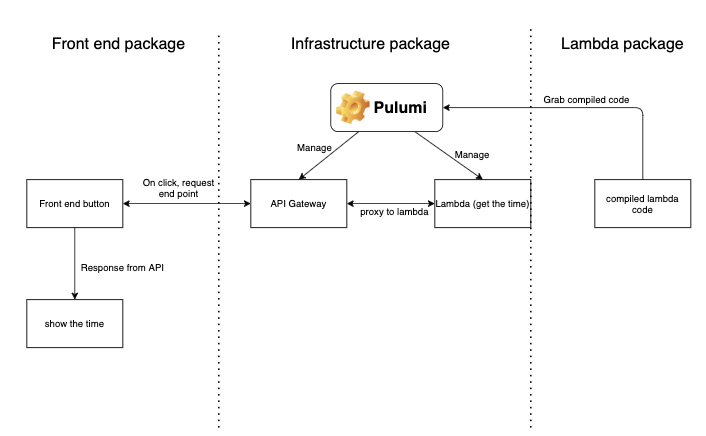

# archPlayground

A place to mess with different arch

## The point?

A place to have a really simple app, but then make branches where we play with different architecture. With those branches we can then compose integration branches to compose some architecture patterns together.

## The base project

This is how the project is currently set up. it is just a front end app with button that will get the time from an API which in turn will call a lambda to actually get the time. This will then be shown to the user in the front end app.

 

 

## A note on setup

You will need the following env vars.

**Front end**
 
`REACT_APP_API_GATEWAY_ENDPOINT`, the URL of your gateway when the stage is deployed.

 

**Infrastructure**
 
`AWS_PROFILE`, the name of your profile to connect with Pulumi, you can also configure this with specific env vars but I find the profile works best. Have a look at [this](https://www.pulumi.com/docs/intro/cloud-providers/aws/setup/)
